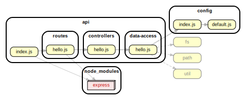

<!-- BEGIN title -->

# API

<!-- END title -->

<!-- BEGIN TREE -->

<!-- END TREE -->

<!-- BEGIN TOC -->

- controllers
  - [data-type-1.js](#apicontrollersdata-type-1js)
  - [data-type-2.js](#apicontrollersdata-type-2js)
- data-access
  - [local-json.js](#apidata-accesslocal-jsonjs)
- logic
  - [do-a-thing.js](#apilogicdo-a-thingjs)
- middleware
  - [authentication.js](#apimiddlewareauthenticationjs)
- routes
  - [data-type-1.js](#apiroutesdata-type-1js)
  - [data-type-2.js](#apiroutesdata-type-2js)
- [dev.js](#apidevjs)
- [index.js](#apiindexjs)

---

<!-- END TOC -->

---

<!-- BEGIN DOCS -->

# /controllers

<a href="../../api/controllers/data-type-1.js" id="apicontrollersdata-type-1js">../api/controllers/data-type-1.js</a>

<a href="../../api/controllers/data-type-2.js" id="apicontrollersdata-type-2js">../api/controllers/data-type-2.js</a>

---

# /data-access

<a href="../../api/data-access/local-json.js" id="apidata-accesslocal-jsonjs">../api/data-access/local-json.js</a>

## Functions

<dl>
<dt><a href="#constructFilePath">constructFilePath(ownerName)</a> ⇒ <code>String</code></dt>
<dd></dd>
<dt><a href="#readData">readData(ownerName)</a> ⇒ <code>Promise.&lt;{exists: Boolean, data: Object}&gt;</code></dt>
<dd></dd>
<dt><a href="#writeData">writeData(ownerName, data)</a> ⇒ <code>Promise.&lt;void&gt;</code></dt>
<dd></dd>
</dl>

## constructFilePath(ownerName) ⇒ <code>String</code>

| Param     | Type                |
| --------- | ------------------- |
| ownerName | <code>String</code> |

## readData(ownerName) ⇒ <code>Promise.&lt;{exists: Boolean, data: Object}&gt;</code>

| Param     | Type                |
| --------- | ------------------- |
| ownerName | <code>String</code> |

## writeData(ownerName, data) ⇒ <code>Promise.&lt;void&gt;</code>

| Param     | Type                |
| --------- | ------------------- |
| ownerName | <code>String</code> |
| data      | <code>String</code> |

---

# /logic

<a href="../../api/logic/do-a-thing.js" id="apilogicdo-a-thingjs">../api/logic/do-a-thing.js</a>

---

# /middleware

---

# /routes

<a href="../../api/routes/data-type-1.js" id="apiroutesdata-type-1js">../api/routes/data-type-1.js</a>

<a href="../../api/routes/data-type-2.js" id="apiroutesdata-type-2js">../api/routes/data-type-2.js</a>

---

<a href="../../api/dev.js" id="apidevjs">../api/dev.js</a>

<a href="../../api/index.js" id="apiindexjs">../api/index.js</a>

<!-- END DOCS -->
