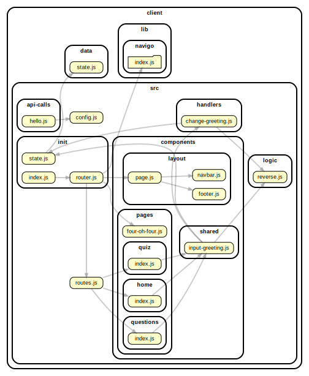

<!-- BEGIN title -->

# CLIENT

<!-- END title -->

<!-- BEGIN TREE -->

<!-- END TREE -->

<!-- BEGIN TOC -->

- data
  - [state.js](#clientdatastatejs)
- public
- src
  - api-calls
    - [hello.js](#clientsrcapi-callshellojs)
  - components
    - layout
      - [footer.js](#clientsrccomponentslayoutfooterjs)
      - [navbar.js](#clientsrccomponentslayoutnavbarjs)
      - [page.js](#clientsrccomponentslayoutpagejs)
    - pages
      - home
        - [index.js](#clientsrccomponentspageshomeindexjs)
      - questions
        - [index.js](#clientsrccomponentspagesquestionsindexjs)
      - quiz
        - [index.js](#clientsrccomponentspagesquizindexjs)
      - [four-oh-four.js](#clientsrccomponentspagesfour-oh-fourjs)
    - shared
      - [input-greeting.js](#clientsrccomponentssharedinput-greetingjs)
  - handlers
    - [change-greeting.js](#clientsrchandlerschange-greetingjs)
  - init
    - [index.js](#clientsrcinitindexjs)
    - [router.js](#clientsrcinitrouterjs)
    - [state.js](#clientsrcinitstatejs)
  - logic
    - [reverse.js](#clientsrclogicreversejs)
  - [config.js](#clientsrcconfigjs)
  - [routes.js](#clientsrcroutesjs)
- styles

---

<!-- END TOC -->

---

<!-- BEGIN DOCS -->

# /data

<a href="../../client/data/state.js" id="clientdatastatejs">../client/data/state.js</a>

---

# /public

---

# /src

## /api-calls

<a href="../../client/src/api-calls/hello.js" id="clientsrcapi-callshellojs">../client/src/api-calls/hello.js</a>

## hello ⇒ <code>Promise.&lt;string&gt;</code>

Fetches text from the /api/hello route.

**Returns**: <code>Promise.&lt;string&gt;</code> - - A promise resolving to the /api/hello text.  
**Throws**:

- <code>Error</code> HTTP error! Status: {number}.

---

## /components

### /layout

<a href="../../client/src/components/layout/footer.js" id="clientsrccomponentslayoutfooterjs">../client/src/components/layout/footer.js</a>

## footer ⇒ <code>HTMLDivElement</code>

The shared footer.

**Returns**: <code>HTMLDivElement</code> - A rendered footer element.

<a href="../../client/src/components/layout/navbar.js" id="clientsrccomponentslayoutnavbarjs">../client/src/components/layout/navbar.js</a>

## navbar ⇒ <code>HTMLDivElement</code>

The shared navbar.

**Returns**: <code>HTMLDivElement</code> - A rendered nav bar element.

| Param  | Type                | Description                          |
| ------ | ------------------- | ------------------------------------ |
| routes | <code>object</code> | A routes object, see /src/routes.js. |

<a href="../../client/src/components/layout/page.js" id="clientsrccomponentslayoutpagejs">../client/src/components/layout/page.js</a>

## page ⇒ <code>HTMLDivElement</code>

The page layout component.

**Returns**: <code>HTMLDivElement</code> - A rendered page element.  
**Throws**:

- <code>TypeError</code> When the bodyComponent is not a function or DOM element.

| Param         | Type                                              | Description                               |
| ------------- | ------------------------------------------------- | ----------------------------------------- |
| bodyComponent | <code>function</code> \| <code>HTMLElement</code> | The body for the newly rendered page.     |
| routes        | <code>object</code>                               | The application's routes, for the navbar. |

---

### /pages

#### /home

<a href="../../client/src/components/pages/home/index.js" id="clientsrccomponentspageshomeindexjs">../client/src/components/pages/home/index.js</a>

## home ⇒ <code>HTMLDivElement</code>

The home page.

**Returns**: <code>HTMLDivElement</code> - A rendered home page.

---

#### /questions

<a href="../../client/src/components/pages/questions/index.js" id="clientsrccomponentspagesquestionsindexjs">../client/src/components/pages/questions/index.js</a>

## questions ⇒ <code>HTMLDivElement</code>

The questions page.

**Returns**: <code>HTMLDivElement</code> - A rendered questions page.

---

#### /quiz

<a href="../../client/src/components/pages/quiz/index.js" id="clientsrccomponentspagesquizindexjs">../client/src/components/pages/quiz/index.js</a>

## quiz ⇒ <code>HTMLDivElement</code>

The quiz page.

**Returns**: <code>HTMLDivElement</code> - A rendered quiz page.

---

<a href="../../client/src/components/pages/four-oh-four.js" id="clientsrccomponentspagesfour-oh-fourjs">../client/src/components/pages/four-oh-four.js</a>

---

### /shared

<a href="../../client/src/components/shared/input-greeting.js" id="clientsrccomponentssharedinput-greetingjs">../client/src/components/shared/input-greeting.js</a>

---

---

## /handlers

<a href="../../client/src/handlers/change-greeting.js" id="clientsrchandlerschange-greetingjs">../client/src/handlers/change-greeting.js</a>

---

## /init

<a href="../../client/src/init/index.js" id="clientsrcinitindexjs">../client/src/init/index.js</a>

<a href="../../client/src/init/router.js" id="clientsrcinitrouterjs">../client/src/init/router.js</a>

<a href="../../client/src/init/state.js" id="clientsrcinitstatejs">../client/src/init/state.js</a>

---

## /logic

<a href="../../client/src/logic/reverse.js" id="clientsrclogicreversejs">../client/src/logic/reverse.js</a>

## reverse ⇒ <code>string</code>

Reverses a string.

**Returns**: <code>string</code> - The reversed string.

| Param | Type                | Default                               | Description          |
| ----- | ------------------- | ------------------------------------- | -------------------- |
| [str] | <code>string</code> | <code>&quot;&#x27;&#x27;&quot;</code> | A string to reverse. |

---

<a href="../../client/src/config.js" id="clientsrcconfigjs">../client/src/config.js</a>

<a href="../../client/src/routes.js" id="clientsrcroutesjs">../client/src/routes.js</a>

## routes

Defines the route URLs, names and callbacks.

---

# /styles

---

<!-- END DOCS -->
